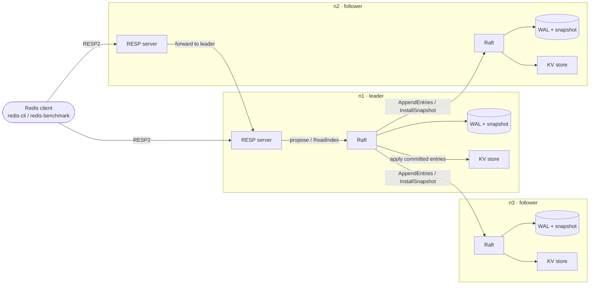
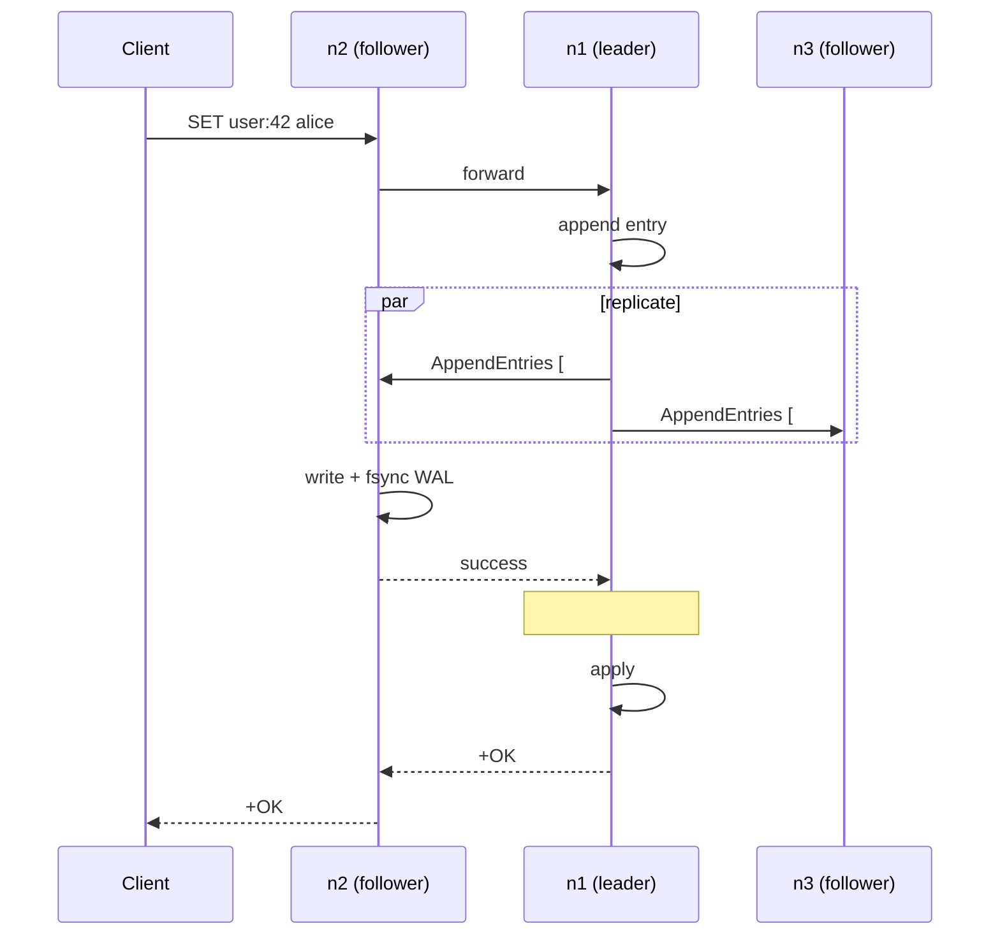

# QuorumDB

**A Redis-compatible key-value database in Go that replicates every write across a 3-node cluster using Raft, implemented from scratch.**


## What I built

QuorumDB is a small distributed database that behaves like Redis from the outside and like a replicated state machine on the inside. I implemented the Raft consensus algorithm from the original paper without a consensus library. That covers leader election, log replication, crash recovery from disk, and snapshots. On top of it sits a server that speaks the Redis wire protocol, so the standard `redis-cli` and `redis-benchmark` tools work against it unchanged.

- **Consensus from scratch:** about 1,600 lines of Go implementing Raft (leader election, log replication, write-ahead logging, snapshots, linearizable reads). The whole project has 55 unit and integration tests.
- **Zero lost writes under failure:** 100 automated chaos runs injected 675 faults (process kills, freezes, network partitions). All 229,198 acknowledged writes survived, and every run's history was verified linearizable by the porcupine checker.
- **Fast:** about 38,000 writes/s and 116,000 reads/s through the leader of a 3-node cluster on one laptop, and 234,000 writes/s with pipelining (numbers and setup below).
- **Drop-in Redis compatibility:** tested with the official `redis-cli` and `redis-benchmark`.

**Tech:** Go (the database itself uses only the standard library), Raft, TCP and RPC networking, write-ahead logging with fsync, Docker Compose, the porcupine linearizability checker, charmbracelet/vhs for the recordings.

## Features

- **Redis protocol (RESP2):** use `redis-cli`, `redis-benchmark` or any Redis client library, against any node.
- **Raft from scratch:** leader election (with pre-vote and check-quorum), log replication, persistence, snapshots and log compaction.
- **No acknowledged write is lost:** a write gets `OK` only after a majority of nodes has it on disk.
- **Followers forward writes to the leader:** clients never need to know which node leads.
- **Linearizable reads:** the leader confirms it is still leader (ReadIndex) before answering, so reads are never stale.
- **Crash recovery:** a checksummed write-ahead log plus snapshots; a restarted node catches up on its own.
- **Tested under failure:** a fault-injection harness kills, pauses and partitions nodes, and every run's history is checked for linearizability.

## Architecture



Each node keeps a **Raft log**: an ordered list of `(index, term, command)` entries. The leader decides the order, an entry is **committed** once it is on disk on a majority of nodes, and every node applies committed entries to its key-value store in the same order. So all three stores end up identical. Old log entries are folded into a snapshot and deleted.

Life of one write sent to a follower:



## Quick start

You need Docker (with Compose). `redis-cli` on your machine is optional; it also ships inside the containers (`docker compose exec n1 redis-cli`).

```bash
git clone https://github.com/simar-s2/quorumdb && cd quorumdb
make cluster-up          # build the image, start 3 nodes, wait for a leader
```


The nodes listen on `localhost:6379` (n1), `6380` (n2) and `6381` (n3). Write through one node and read from the others:

```bash
redis-cli -p 6379 SET user:42 alice
redis-cli -p 6381 GET user:42          # "alice"
make cluster-status                    # role, term and log position of each node
```


Kill the leader and watch the cluster recover:

```bash
make kill-leader                       # kill -9 the current leader's container
make cluster-status                    # a new leader has been elected
docker compose start                   # the old leader recovers from disk and catches up
make cluster-down                      # stop everything and delete the data
```

To build and run a node without Docker (Go 1.23+):

```bash
make build
./bin/quorumdb -id n1 -redis-addr :6379 -raft-addr :7000 \
  -peers n1=host1:7000,n2=host2:7000,n3=host3:7000 -data ./data/n1
```

## Supported commands

| Command | Notes |
|---|---|
| `PING [msg]`, `ECHO msg` | answered by the node you are connected to |
| `GET key`, `MGET key [key ...]` | linearizable reads |
| `SET key value [NX\|XX] [EX s\|PX ms\|EXAT ts\|PXAT ms\|KEEPTTL]` | `NX` = only if missing, `XX` = only if present |
| `MSET key value [key value ...]` | atomic |
| `DEL key [key ...]`, `EXISTS key [key ...]` | return counts, like Redis |
| `INCR`, `DECR`, `INCRBY`, `DECRBY` | 64-bit integers with Redis' overflow errors |
| `EXPIRE key seconds [NX\|XX\|GT\|LT]`, `PEXPIRE` | TTLs are replicated as absolute times |
| `TTL key`, `PTTL key` | `-2` missing, `-1` no expiry |
| `INFO [raft]`, `DBSIZE`, `DEBUG DIGEST` | cluster role, term, commit index; a hash to compare replicas |

## How replication and failover work

- **Writes:** any node accepts a write and forwards it to the leader. The leader appends it to its log and sends it to both followers. Each follower saves it to disk (fsync) and replies. Once two of the three nodes have it on disk, the write is committed, applied, and acknowledged. Concurrent writes share one network round trip and one disk flush.
- **Reads:** before answering, the leader checks with a quick heartbeat round that a majority still follows it. A leader that was partitioned or paused, and doesn't know it has been replaced, cannot pass this check, so it never returns stale data.
- **Failover:** followers expect a heartbeat every 50 ms. After 300–600 ms of silence a follower asks the others for votes and becomes leader only if its log has every committed write. Requests that were in flight when the old leader died get an "outcome unknown" error, never a false `OK`.
- **Recovery:** a restarted node reloads its snapshot, replays its write-ahead log, and rejoins as a follower. The leader sends it whatever it missed: log entries, or a snapshot if those entries were already compacted away.

## Benchmarks

Measured with the official `redis-benchmark` against the Docker cluster. Each row is the median of 3 runs, with the range in brackets.

| Target | Pipelining | Command | Requests/s | p50 latency | p99 latency |
|---|---|---|---:|---:|---:|
| Leader | none (`-P 1`) | SET | **38,292** (36,969–38,395) | 1.11 ms | **5.13 ms** (4.63–5.86) |
| Leader | none (`-P 1`) | GET | **116,482** (113,186–116,686) | 0.34 ms | **0.67 ms** (0.67–0.77) |
| Leader | 16 (`-P 16`) | SET | 234,192 (226,244–248,447) | 2.22 ms | 10.61 ms (8.28–11.81) |
| Leader | 16 (`-P 16`) | GET | 1,428,571 (1,307,190–1,481,481) | 0.40 ms | 1.89 ms (1.66–2.17) |
| Follower (forwards to leader) | none (`-P 1`) | SET | 30,111 (29,270–30,534) | 1.46 ms | 4.66 ms (4.62–4.78) |
| Follower (forwards to leader) | none (`-P 1`) | GET | 60,772 (60,514–60,976) | 0.73 ms | 1.79 ms (1.73–1.90) |

**Setup**

- **Hardware:** MacBook Pro, Apple M1 Pro (10 cores), 32 GB RAM, macOS 26.6.2, on AC power. Docker Desktop 28.3.3, VM with 10 CPUs and 7.7 GiB RAM. All three nodes and the benchmark client share this one machine.
- **Cluster:** `make cluster-up` with default settings: fsync on, 50 ms heartbeats, 300 ms election timeout, snapshot every 10,000 entries.
- **Client:** redis-benchmark 8.10.2, run in a container on the cluster's Docker network so Docker Desktop's port forwarding is not measured. 200,000 requests, 50 parallel clients, random keys from a 100,000-key space, 3-byte values.
- **Commands:** `make bench` runs `redis-benchmark -h <leader> -p 6379 -t set,get -n 200000 -c 50 -P 1 -r 100000 --csv`. `make bench PIPELINE=16` gives the pipelined rows and `make bench TARGET=follower` the follower rows.


*The recording is a separate run, made while the screen recorder was also using the CPU, so its numbers are a little lower than the table.*

**What limits it:** every write waits for two disk flushes (the leader's and one follower's), and here all three nodes share one virtual disk, so write p99 is mostly fsync time plus queueing. Reads need no disk flush, only one heartbeat round, which is why they are about 3x faster.

**Durability caveat:** an fsync inside Docker Desktop's Linux VM took about 0.2 ms (p50) in a microbenchmark. Run natively on macOS, where Go's fsync issues a full `F_FULLFSYNC` flush (about 5 ms each), the same 3-node cluster does about 2,250 writes/s without pipelining (p99 36 ms) and about 29,750 writes/s with `-P 16`. Reads stay at about 92,000/s.

## Fault-tolerance testing

**Method.** `make chaos` runs 100 independent trials. Each trial:

1. Starts a fresh 3-node cluster as separate processes, with a TCP proxy on each of the six directed links between nodes, so the harness can cut any link in either direction.
2. Runs 8 concurrent clients against random nodes: `SET` (unique values), `GET` and `DEL` on 4 keys, and `INCR`/`GET` on 2 counters.
3. For 10 seconds, repeatedly waits 0.2–0.8 s, injects a random fault, and heals it 0.5–2.5 s later. A quarter of the time two faults overlap, which can leave no majority. The faults:
   - `kill -9` a node (the leader half the time), then restart it from its data directory;
   - freeze a node with `SIGSTOP`, which creates a stale leader that still thinks it is in charge, then resume it;
   - isolate a node, cut the link between two nodes, or cut just one direction of a link. Links are cut either with resets (errors right away) or by silently dropping traffic (timeouts).

   Snapshots are taken every 200 log entries, so log compaction and snapshot transfer to lagging nodes happen constantly.
4. Heals everything, reads the final value of every key, and checks three things:
   - **Linearizability:** the full history of calls, responses and timings is checked with [porcupine](https://github.com/anishathalye/porcupine) against a model of a key-value store. A lost acknowledged write, a stale read, or an increment applied twice all fail this check. Writes whose outcome the client could not know (timeout, dropped connection) may count as either applied or not, but every read must agree on which.
   - **Counters:** each counter's final value must be at least the number of acknowledged `INCR`s and at most acknowledged plus unknown.
   - **Convergence:** all three nodes reach the same log position and the same state hash.

**Results** (`make chaos`: 100 runs, 23 minutes on the laptop above)

| | |
|---|---|
| Runs passed | **100 / 100** |
| Linearizability violations (porcupine) | **0** |
| Acknowledged writes | **229,198, none lost** |
| Writes with an unknown outcome (timed out during a fault) | 1,990 |
| Reads checked | 154,584 |
| Faults injected | 675: 109 kills, 119 freezes, 109 node isolations, 109 two-node splits, 229 one-way link cuts |
| Runs where all replicas ended with identical state | 100 / 100 |


**Does the checker actually catch bugs?** I ran the same harness against two deliberately broken builds (`make chaos-negative`). One served reads from local state instead of ReadIndex (`-unsafe-local-reads`); the other acknowledged `SET` before it was committed (`-unsafe-early-ack`). Porcupine flagged 10 of 10 runs as non-linearizable for each.

The harness also caught a real bug during development: a fixed 30-second timeout on snapshot transfers let a silently dropped connection stall replication to one follower long after the network healed. The timeout now scales with snapshot size.

## Project layout

```
cmd/quorumdb/         the database node
cmd/chaos/            fault-injection harness (process kills, pauses, network cuts, porcupine check)
internal/raft/        Raft: elections, replication, commit, write-ahead log, snapshots, ReadIndex
internal/kv/          the replicated key-value store (state machine)
internal/server/      Redis protocol server, command handling, forwarding to the leader
internal/transport/   node-to-node RPC over TCP
internal/resp/        RESP2 protocol parser and encoder
internal/netproxy/    TCP proxy used to cut and blackhole network links in tests
internal/chaos/       linearizability model for the porcupine checker
scripts/              cluster status and benchmark helpers
docs/images/          the terminal recordings in this README
```

## Running the tests

```bash
make test         # unit and integration tests
make test-race    # same, with Go's race detector
make chaos        # 100 fault-injection runs (about 25 minutes); RUNS=5 for a quick one
make chaos-negative   # the same harness against deliberately unsafe builds (should fail)
```

The Raft unit tests run whole clusters over a simulated network that can partition nodes, cut links, and drop or delay messages. They cover elections (including a forced split vote and pre-vote), log conflicts after partitions, restarts and crash recovery, snapshots and InstallSnapshot, stale-leader reads, and a combined churn test. The integration tests run three real nodes over TCP.

## Limitations and roadmap

Current limitations:

- **Fixed membership:** nodes are configured at startup; adding or removing nodes at runtime is not supported yet.
- **Reads go through the leader:** followers forward reads instead of serving them, so read throughput does not grow with more nodes.
- **In-memory data:** the dataset must fit in RAM, and a snapshot is a full copy sent in one message.
- **A subset of Redis:** strings only; no hashes, lists, transactions, pub/sub, AUTH or TLS.
- **One replication batch in flight per follower.** I tried pipelining AppendEntries, but on this setup it was slower: more in-flight batches meant more, smaller disk flushes on the followers.
- **Measured on one laptop:** all three nodes share one CPU and one disk, so the numbers above say little about a real multi-machine deployment.

Roadmap:

1. Adding and removing nodes at runtime (Raft membership changes).
2. Serving reads from followers (read index from the leader) and optional leader leases.
3. A dedicated disk-writer thread so replication can be pipelined without extra disk flushes.
4. Chunked, streaming snapshots.
5. Hashes, lists and `MULTI`/`EXEC`.
6. Disk-fault and clock-skew injection in the chaos harness, and a run across separate machines.

## License

[MIT](LICENSE)
